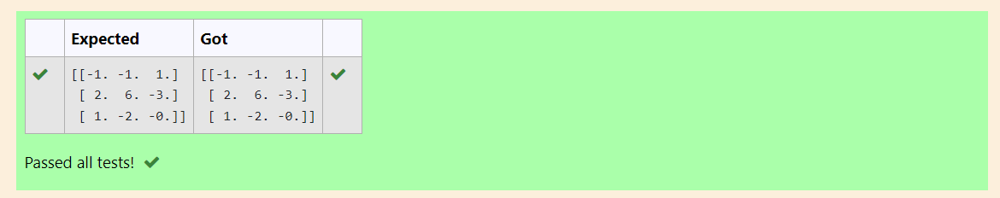

# INVERSE-OF-A-MATRIX
## Aim:
To write a python program to find the inverse of a matrix
## Equipment’s required:
1. 	Hardware – PCs
2. 	Anaconda – Python 3.7 Installation / Moodle-Code Runner
## Algorithm:
### Step1 : 
Import numpy as np.
### Step 2:
Forms a 3x3 matrix using array() function. 
### Step 3: 
Using the formula determine the rank of the matrix.
### Step 4: 
Prints the obtained matrix.
## Program:
```
#Program to find the inverse of a matrix.
#Developed by: 
#RegisterNumber:
import numpy as np
a=np.array([[6,2,3],
            [3,1,1],
            [10,3,4]])
print(np.linalg.inv(a))

```
## Output:

## Result:
Thus the inverse of given matrix is successfully solved using python program

